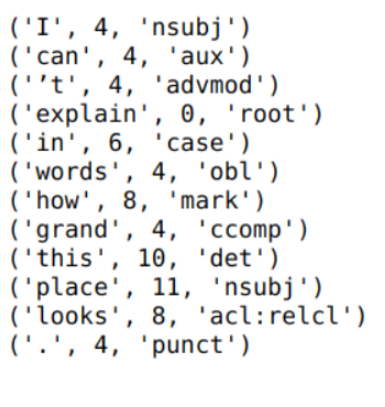

# Structured-sentiment-analysis-using-Dependency-Graphs

The work was done as a semester project, and this is our approach to the competition [SemEval-2022 Task 10: Structured Sentiment competition](https://competitions.codalab.org/competitions/33556).

## Problem Statement 

Division of fine-grained sentiment into sub-tasks can be counterproductive. So, a new idea was propsed - **Structured Sentiment Analysis**. The task is predicting the sentiment graph, which can be brokedn down to 2 subtasks - 
1. Extract all of the opinion tuples O = Oi, ... ,On  in a text.
2. Each opinion Oi is a tuple (h, t, e, p), where
h is a holder who expresses a polarity p towards a target t through a sentiment expression e, implicitly defining the relationships between the elements of a sentiment graph.

## Approach

There are 2 important steps in our methodoloy - 
1. Parsing the sentences - 
    - Stanford dependency parser was used 
    - Relationship between main words of source and polar expression and target and polar expression were found
    - Main words are the LCA of the words of a phrase
    - Sentences with number of words between 8 and 15 was selected
    - The major observation was : The most common relation between both source and polar expression and target and polar expression was nsubj (subject), followed by obj (object) 

_Note - Observation can be biased since a small sample was taken_

  <i>Main words for a dependency graph</i>

  
&nbsp; &nbsp; &nbsp; &nbsp;
  

2. Get word embeddings - 
    - Get word embeddings using Multilingual BERT 
    - Used bert-as-service uses BERT as a sentence encoder and hosts it as a service via ZeroMQ

3. Using BERT - 
    - Found embeddings for each of the three - source, target and polar expression
    - Used last four layers of BERT for getting word embeddings
    - Finally made three different data frames with two columns - sentence and word embeddings, for all source, target and polar expression

